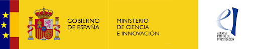

## Welcome to my GitHub Page.

I have worked as postdoctoral researcher funded by the Spanish Ministry of Science and Innovation through 
the program “Juan de la Cierva” (2010-2012). In 2012, I moved to USA (2012- 2017) to work with **Dr Lisa J. Rowland** at the Genetic Improvement of Fruits and Vegetables Laboratory, [USDA-ARS](https://www.ars.usda.gov/northeast-area/beltsville-md/beltsville-agricultural-research-center/genetic-improvement-for-fruits-vegetables-laboratory/people/lisa-rowland/) (Beltsville, MD, USA). In January 2017, I moved back to Spain to work in the research group of **Dr Juan Gil** "*[Mejora Genética Vegetal](https://scholar.google.com/citations?authuser=1&user=jQPGxsAAAAAJ)*" focused on identification and analysis of differentially expressed genes during plant development and biotic/abiotic stresses.   
  
Currently, I am a **Ramón y Cajal Research Fellow** funded by the [Spanish Reseach State Agency](http://www.aei.gob.es/) and work at the University of Córdoba. My research line is focused on unravelling the molecular basis controlling flowering time in chickpea. Understanding how individual genetic variants combine to provide adaptation in specific situations is fundamental to accelerating introgression of new traits into adapted backgrounds. Flowering time is the major domestication trait defining the adaptation of chickpea to different agro-climatic conditions, and therefore is a major determinant of its productivity.  
Previously, I have worked as a **Marie Sklodowska-Curie Fellow** funded by the European Comission under the [Horizon2020](https://cordis.europa.eu/project/rcn/221706/factsheet/en) program.   
  
I look for ways to integrate bioinformatics with experimentation. I am an advocate of gene expression studies in compliance with [MIQE](http://clinchem.aaccjnls.org/content/55/4/611) guidelines. I also enjoy working with Big Data sets. I like data, and I like to extract biological value out of data. If you are interested in working with me, feel free to contact me. I am always happy to work with motivated and enthusiatic people.  

At the University of Córdoba, I teach an introductory [Course for Data Analysis](https://jdieramon.github.io/CursoAnalisisDatos/cursoR.html){:target="_blank"} using the `R` programming language.  We have already run 4 editions and the course usually gets some very nice reviews and positive feedbacks from our students.   
  
If you like, network with me on [Github](https://github.com/jdieramon) or [Twitter](https://twitter.com/jdieramon).    

 
Funding23. 
{ width=10% }.   
### Contact
The best way to contact me is by [email](mailto:jose.die@uco.es).
