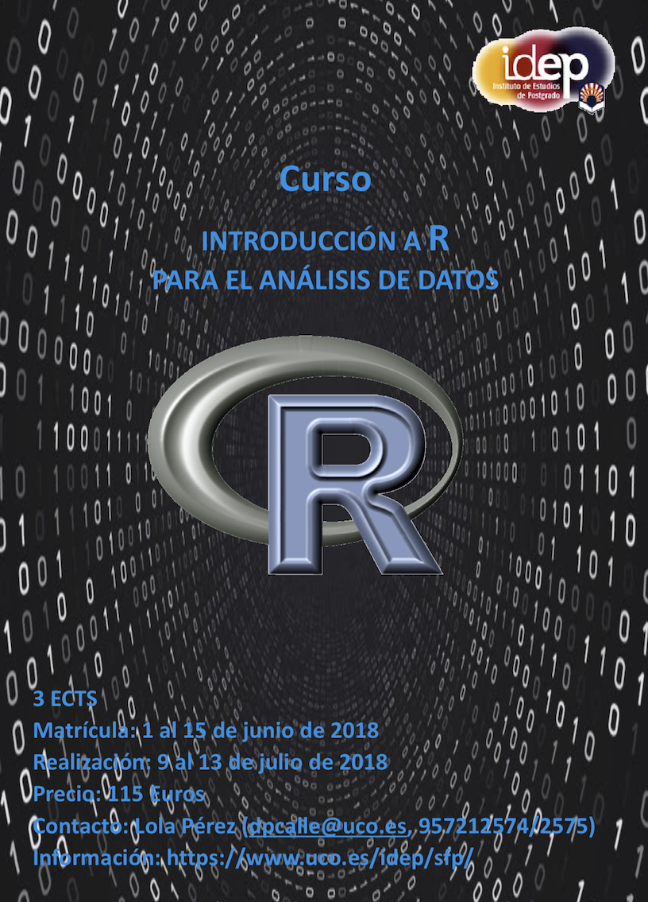

[Home](../index.html)
  
### Calendar Events

|   |  |  |
|---|---|---|
| <a href="#2019">2019</a> | <a href="#2018">2018</a> | <a href="#2017">2017</a> | <a href="#2016">2016</a> |
| <a href="#2015">2015</a> | <a href="#2014">2014</a> | <a href="#2013">2013</a> | <a href="#2012">2012</a> |
  
   
  
### Coming Events 

 
  
### 2019
* DEC  
NOV 25 - DEC 4. Cordoba. **New edition** of our course '[Introduction to R programming for Data Science](https://jdieramon.github.io/CursoAnalisisDatos/){:target="_blank"}'. (30h). University of Cordoba. **If you are interested in organize this course in your institution, please [contact](mailto:@q72pecam@uco.es) us**  
Serving as Reviewer for the journal : Revista Española de Estudios Agrosociales y Pesqueros ([REEAP](https://www.mapa.gob.es/es/ministerio/servicios/publicaciones/Revista_de_Estudios.aspx)).  
  
* NOV  
Serving as [Reviewer](https://publons.com/author/420232/jose-v-die#) for the **Open Access** journal : International Journal of Molecular Sciences.  
**Invited speaker** : Presentación paquete [geneHummus](https://cran.r-project.org/web/packages/geneHummus/index.html) : anotación automática de familias génicas. [XI Jornadas de Usuarios R](http://r-es.org/XIjuR/). NOV 14 - 16. Madrid, Spain.          

* OCT       
Serving as [Reviewer](https://publons.com/author/420232/jose-v-die#) for the journals :  
  
  - Plant Physiology and Biochemistry
  - International Journal of Molecular Sciences
  

* SEP   
Serving as [Reviewer](https://publons.com/author/420232/jose-v-die#) for the journals :  
  
  - Plant Physiology and Biochemistry
  - International Journal of Molecular Sciences

    
  
* AUG  
Serving as [Reviewer](https://publons.com/author/420232/jose-v-die#) for the journal Genome    
  
* JUL  
Academic director and lecturer of the '[Introduction to R programming for Data Science](https://jdieramon.github.io/CursoAnalisisDatos/){:target="_blank"}'. 3rd edition (30h). University of Cordoba. **If you are interested in organize this course in your institution, please [contact](mailto:@q72pecam@uco.es) us**.    
Co-direction of the final thesis "Búsqueda bioinformática de familias génicas en genomas de cultivos" by **Rocío Sánchez Gil** (Bachelor degree). Dept. Genetics, ETSIAM, University of Cordoba.     
Serving as [Reviewer](https://publons.com/author/420232/jose-v-die#) for the journals :  
   - BMC Genomics
   - Frontiers in Plant Science
   
   
* JUN   
**Invited Seminar** (Organized by PhD Students IdEP, UCO): "Museo del Prado, Lumière Brothers and Open Data in the Molecular Era". University of Cordoba. Jun 7, 2019.   
Serving as [Reviewer](https://publons.com/author/420232/jose-v-die#) for the **Open Access** journals : 
  - Scientific Reports
  - Agronomy  
   

* MAY  
[International Conference on Legume Genetics and Genomics](http://iclgg2019.com/). May 13-17, 2019. Dijon, France.  
Serving as [Reviewer](https://publons.com/author/420232/jose-v-die#) for the journals :  
    
   - International Journal of Molecular Sciences
   - Frontiers in Plant Science
   - Genome  
  
  
* APR  
Serving as [Reviewer](https://publons.com/author/420232/jose-v-die#) for the **Open Access** journals   
  * International Journal of Molecular Sciences
  * Agronomy

* APR 30, 2019   
Lecture on 'Big Data in Plant Genomics'. Course: 'Biotechnology and Plant Breeding'-  [Master's Degree in Agronomic Engineering](https://www.uco.es/etsiam/master-ingenieria-agronomica/index.html). University of Cordoba.

* MAR   
Serving as [Reviewer](https://publons.com/author/420232/jose-v-die#) for the **Open Access** journal Molecules. 

* FEB     
Serving as [Reviewer](https://publons.com/author/420232/jose-v-die#) for the **Open Access** journal International Journal of Molecular Sciences.  
  
  
* JAN     
Serving as [Reviewer](https://publons.com/author/420232/jose-v-die#) for the **Open Access** journal International Journal of Molecular Sciences.    
Serving as Reviewer for PyCon 2019 Charlas. [PYCON 2019](https://us.pycon.org/2019/), Cleveland, May 2019.   

* JAN 31 2019, Córdoba, Spain.  
Molecular Breeding Group Lab Meeting. Seminar "Museo del Prado, Hermanos Lumière y Datos Abiertos en la Era Molecular".   

* JAN 15 2019, San Diego, CA, USA.   
**Invited speaker** GeneHummus: A Computational Pipeline to Define Gene Families and their Expression in Legumes and other Plant Species. Plant and Animal Genome XXVII Conference ([PAG](http://www.intlpag.org/2019/)). January 15, 2019 at 12:00h  

  
 
  
  
### 2018    

* DEC     
Serving as [Reviewer](https://publons.com/author/420232/jose-v-die#) for the **Open Access** journals   
  * Genes
  * International Journal of Molecular Sciences
  * PeerJ
  * Plan Methods  

* DEC 10-20, Córdoba, Spain.     
Academic director and lecturer of the '[Introduction to R programming for Data Science](https://jdieramon.github.io/CursoAnalisisDatos/){:target="_blank"}'. 2nd edition (30h). University of Cordoba. **If you are interested in organize this course in your institution, please [contact](mailto:@q72pecam@uco.es) us**.

*  DEC 5, Córdoba, Spain.  
Co-direction of the final thesis "Genetic control of androsterility in celery" by **Maria Jurado Cañas** (Master Science degree). Dept. Genetics, ETSIAM, University of Cordoba.

* NOV 27-29, Córdoba, Spain.  
Lectures on 'Introduction to R programming for Data Science'- [Master's Degree in Representation and Design in Engineering and Architecture](https://www.uco.es/estudios/idep/masteres/representacion-diseno-ingenieria-arquitectura). 9h. University of Cordoba.  

* NOV   
Serving as [Reviewer](https://publons.com/author/420232/jose-v-die#) for the journal Genes.  

* OCT 22-23, Córdoba, Spain.  
**Invited speaker**: "An automated pipeline to study plant gene families based on protein domain organization". Jornada Científico-Técnica y VI Jornadas Asociación Española de Leguminosas ([AEL](http://www.leguminosas.es/leguminosas-en-la-agricultura-y-la-alimentacion/)).

*  OCT 18, Córdoba, Spain.  
Co-direction of the final thesis "Identification and characterization of the superfamily ALDH in chickpea (*Cicer arietinum*  L.) using bioinformatics open-based tools" by **Rocio Carmona Molero** (Master Science degree). **Extraordinary MSc thesis Award.** Dept. Genetics, ETSIAM, University of Cordoba.    

*  SEP 5-7, Ancona, Italy.   
XXIV National Congress of the Italian Phytopathological Society (SIPaV).    
 
*  AUG 27-31, Dubrovnik, Croatia.   
 69th Annual Meeting of the European Federation of Animal Science ([EAAP 2018](http://www.eaap2018.org)). 
 
* AUG  
Serving as [Reviewer](https://publons.com/author/420232/jose-v-die#) for the **Open Access** Journal of Plant Breeding and Crop Science.    

* AUG 12-15, Orono, Maine, USA.     
North American Blueberry Research and Extension Workers Conference ([NABREW 2018](https://digitalcommons.library.umaine.edu/nabrew2018/))
 
* JUL  
Serving as [Reviewer](https://publons.com/author/420232/jose-v-die#) for the **Open Access** journal Molecules.  
 
* JUL 9-13, Córdoba, Spain.     
Academic director and lecturer of the '[Introduction to R programming for Data Science](https://jdieramon.github.io/CursoAnalisisDatos/){:target="_blank"}'. 1st edition (30h). University of Cordoba. **If you are interested in organize this course in your institution, please [contact](mailto:@q72pecam@uco.es) us**.

* JUL 9-13, Córdoba, Spain.  
Serving as Reviewer of the final thesis "Evaluación de la resistencia a odio en *Vicia faba*" by **Lucía García Castilla** (Master Science degree). Dept. Biochemistry and Molecular Biology, University of Cordoba.    

* MAY 1-30, Bethesda (MD), USA.    
Scientific Visitor Program, [National Center for Biotechnology Information](https://www.ncbi.nlm.nih.gov/) (NCBI-NIH).   

* MAY 12-15, Marrakech, Morocco.    
 7th International Food Legume Research Conference [IFLRC-VII](http://www.iflrc.org/).   

* APRIL  
Talk Selection Committee “PyCon Charlas” [PyCon US](https://us.pycon.org/2018/hatchery/charlas/). Cleveland 2018.   
  
* APRIL   
Serving as [Student Travel Award Committee](http://www.apsnet.org/members/foundation/apply/pages/studenttravelawards.aspx) for the American Phytopathological Society Foundation.

* APRIL   
Serving as [Reviewer](https://publons.com/author/420232/jose-v-die#) for the journal Genes.  

* APR 16, Córdoba, Spain.  
Lecture on 'Molecular regulation of anthocyanins in blueberry'. -  [Master's Degree in Plant Production, Protection and Improvement](https://www.uco.es/estudios/idep/masteres/node/211). University of Cordoba.  

* APR 12, Córdoba, Spain.  
Lecture on 'Big Data in Plant Genomics'. Course: 'Biotechnology and Plant Breeding'-  [Master's Degree in Agronomic Engineering](https://www.uco.es/etsiam/master-ingenieria-agronomica/index.html). University of Cordoba.  

* FEB 7, Córdoba, Spain.  
Lecture on 'Big Data in Plant Genomics'. Course: 'Molecular markers in Plant Breeding'-  [Master's Degree in Biotechnology](https://www.uco.es/estudios/idep/masteres/biotecnologia). University of Cordoba.  

* FEBRUARY.   
Serving as [Reviewer](https://publons.com/author/420232/jose-v-die#) for the journal Plant Physiology and Biochemistry.  

* JAN 13-17, San Diego, CA, USA.  
Plant & Animal Genome Conference [PAG XXVI](http://www.intlpag.org).

### 2017    

* DEC 18-22, Valencia, Spain.     
Course 'NGS sequence analysis'. [COMAV](https://www.comav.upv.es/index.php).   
  
* DECEMBER.   
Serving as [Reviewer](https://publons.com/author/420232/jose-v-die#) for the **Open Access** journal Methods and Protocols.  

* DEC 18, Córdoba, Spain.   
Co-direction of the final thesis "Caracterización del QTLAR3 para resistencia a rabia en garbanzo (*Cicer arietinum* L.)" by **Julián García Muñoz** (Master Science degree). Dept. Genetics, ETSIAM, University of Cordoba.

* DEC 12, Córdoba, Spain.  
Lecture on 'Fundamentals of real-time qPCR'. Course: 'Marcadores Moleculares y su uso en Mejora Vegetal'. [Master's Degree in Plant Production, Protection and Improvement](https://www.uco.es/estudios/idep/masteres/node/211). University of Cordoba.  Building C4-B5. 6-7pm. 

* OCT 19, Córdoba, Spain.  
Lecture on 'Big Data en Genómica de Plantas'. Course: 'Marcadores Moleculares y su uso en Mejora Vegetal'. [Master's Degree in Plant Production, Protection and Improvement](https://www.uco.es/estudios/idep/masteres/node/211). University of Cordoba.  

* OCT 5, Córdoba, Spain.  
Seminar 'Big Data en Genómica de Plantas'. Course: '[Big Data y Machine Learning. Agroalimentación, Agricultura y Montes 4.0](http://www.uco.es/etsiam/bigdata17/)'. University of Cordoba.  

* SEPT 25, Córdoba, Spain.   
Co-direction of the final thesis "Búsqueda de marcadores ligados al gen de la androesterilidad en apio" by **María Jurado Cañas** (Bachelor degree). Dept. Genetics, ETSIAM, University of Cordoba.   

* SEPT 18-22, Siofok, Hungary.     
8th International Conference on Legume Genetics and Genomics ([ICGL2017](http://iclgg2017.hu)).  
    
* MAR  
Serving as [Student Travel Award Committee](http://www.apsnet.org/members/foundation/apply/pages/studenttravelawards.aspx) for the American Phytopathological Society Foundation.
   

* FEB 23, Córdoba (Spain)  
Invited seminar: “Regulación molecular de la biosíntesis de las antocianinas en arándano”, Ansalusian Institute of Agrarian Research and Training, Fisheries, Food and Organic Production.  
  
* FEB 10, Córdoba (Spain)  
Invited seminar: “Regulación molecular de la biosíntesis de las antocianinas en arándano”, [Seminarios Interdepartamentales Bioquímica, Biología Molecular y Genética](http://www.uco.es/dptos/bioquimica-biol-mol/seminarios_interdepartamentales/programa.pdf). [University of Cordoba](http://www.uco.es/internacional/extranjeros/).     
    
### 2016  
  
* OCT 28, Granada (Spain)  
Invited seminar: “Transparencia y buenas prácticas en experimentos qPCR”, [Estación Experimental del Zaidín-CSIC](http://www2.eez.csic.es/?q=es/node/7457).     
  
* OCT 20-21, London (UK)  
Invited speaker: “Quality Control and Technical Variance in plant qPCR analysis”, [4th qPCR & Digital PCR Congress](http://www.global-engage.com/event/qpcr-digital-pcr/). 
  
* SUMMER 2016, USDA-ARS, Beltsville, MD (US)  
Mentorship and supervision to **Luis Antonio Delgado** ([University of California, Riverside](http://www.ucr.edu/)).
  
* AUG 8-11, Atlanta, GA (US)   
[American Society for Horticultural Science](http://www.ashs.org/?page=GeneralConference) (ASHS) annual meeting.  
  
* AUGUST 2016  
Serving as [Reviewer](https://publons.com/author/420232/jose-v-die#) for the journal PlosOne.  
  
* JULY 2016  
Serving as [Reviewer](https://publons.com/author/420232/jose-v-die#) for the journal Scientific Reports.  
Advisory Panel for the [2nd qPCR & Digital PCR Congress USA](http://www.global-engage.com/event/4bio-qpcr/). JUL 11-12, Philadelphia, PA.  
  
* MAR  
Serving as [Student Travel Award Committee](http://www.apsnet.org/members/foundation/apply/pages/studenttravelawards.aspx) for the American Phytopathological Society Foundation.
 
  
### 2015

* OCT  
Serving as [External Expert Reviewer](https://www.ncn.gov.pl/?language=en) for grants panel. National Science Centre, Poland.
  
* SEP 28, Bethesda, MD (US)  
[Presenting Data & Information Course](https://www.edwardtufte.com/tufte/index) by **Edward Tufte**.
  
* SUMMER 2015, USDA-ARS, Beltsville, MD (US)    
Mentorship and supervision to **Andrea Irizarry** (Inter American University of Puerto Rico).
  
* JUN 25-26, San Diego, CA (US)    
Session Chairman “Plant, Food and Environmental Case Studies”. [qPCR & Digital PCR Congress USA](http://www.global-engage.com/event/digital-and-qpcr/).    
    
* JUN 25-26, San Diego, CA (US)  
Invited speaker: “Quality control and Technical Variance in plant qPCR analysis”. [qPCR & Digital PCR Congress USA](http://www.global-engage.com/event/digital-and-qpcr/).    
  
* JUN 11, Beltsville, MD (US)  
[GIFVL meeting](https://www.ars.usda.gov/northeast-area/beltsville-md/beltsville-agricultural-research-center/genetic-improvement-for-fruits-vegetables-laboratory/). Seminar: “Global patterns of protein abundance during the development of cold hardiness in blueberry”  
    
* JUN 4, Córdoba (Spain)  
Report as External Referee on the PhD Thesis presented in the [University of Cordoba](http://www.uco.es/internacional/extranjeros/). “Suitability of summer squash cultivars to be processed as fresh-cut products”. PhD candidate: **María Teresa Blanco Díaz**.  

* JAN 14, Almeria (Spain)    
Serving as a PhD final defense committee member. [University of Almeria](http://cms.ual.es/UAL/en/). “Nuevos recursos para la mejora genética de la especie *Cucurbita pepo*: colección de mutantes y plataforma de selección TILLING”. PhD candidate: **Nelly Vicente Dólera**.  
[Teseo](https://www.educacion.gob.es/teseo/imprimirFichaConsulta.do?idFicha=376584)  

### 2014

* AUG 23, Deadline for Free access link:  
[Elucidating cold acclimation pathway in blueberry by transcriptome profiling, Die and Rowland (2014).](http://www.sciencedirect.com/science/article/pii/S0098847213002281)  
  
* AUG 21-22, Laurel, MD (US)    
[31th MAPMBS Conference](http://wp.towson.edu/mapmbs/)  

* JUNE 23-26, Atlantic City, NJ (US)  
12th North American Blueberry Research and Extension Workers (NABREW) Conference  

### 2013

* AUG 15-16, Laurel, MD (US)  
[30th MAPMBS Conference](http://wp.towson.edu/mapmbs/)    
  
* MAR 14, Beltsville (US)  
[GIFVL meeting](https://www.ars.usda.gov/northeast-area/beltsville-md/beltsville-agricultural-research-center/genetic-improvement-for-fruits-vegetables-laboratory/). Seminar: “Quality controls in qPCR”    

### 2012

* AUG 16-17, Laurel, MD (US)  
[29th MAPMBS Conference](http://wp.towson.edu/mapmbs/)    
  
* APR 16-20, Almería (Spain)  
[XIII Congreso Nacional Ciencias Hortícolas (SECH)](http://www.sech.info/)  

