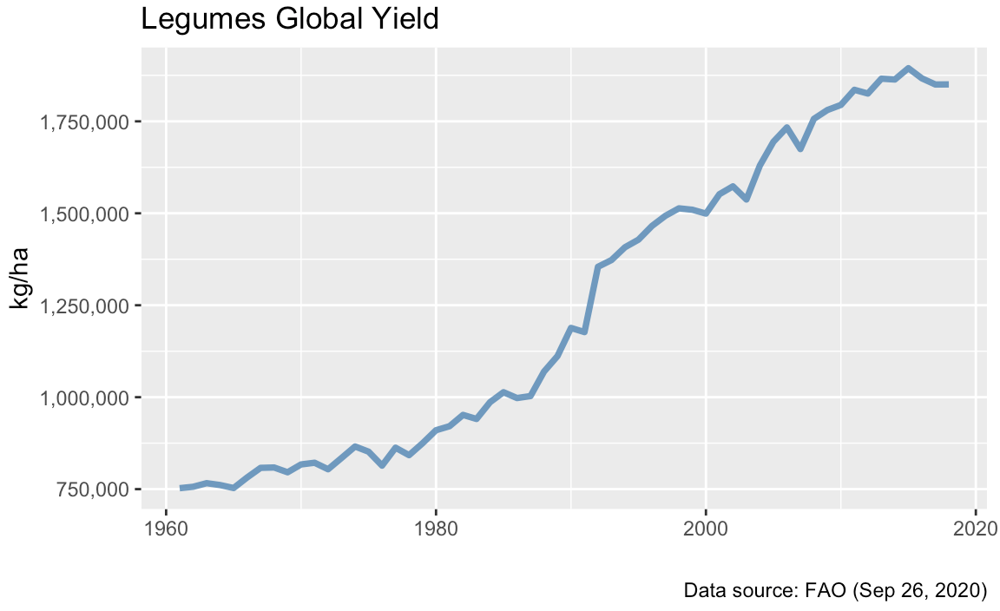
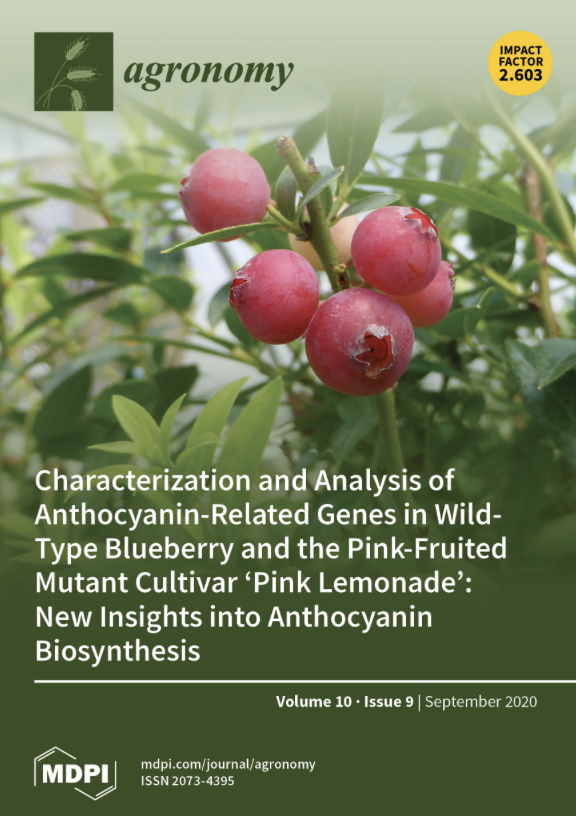
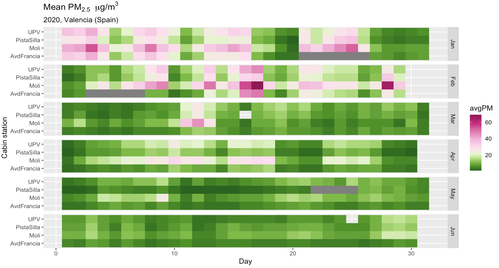
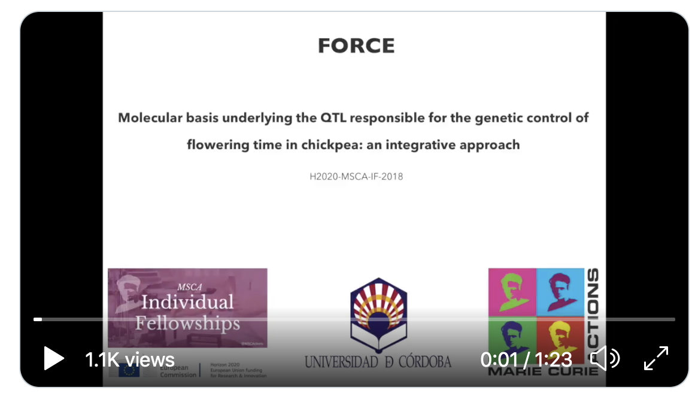
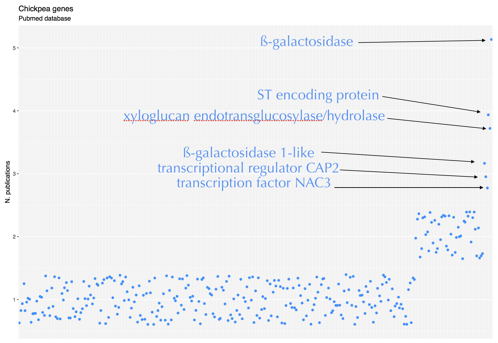
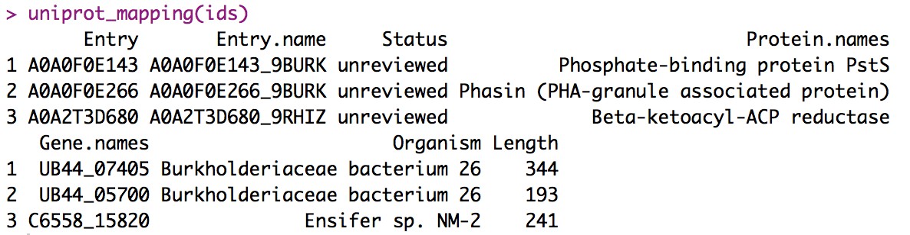
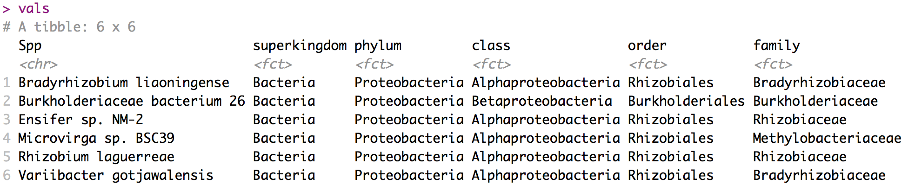
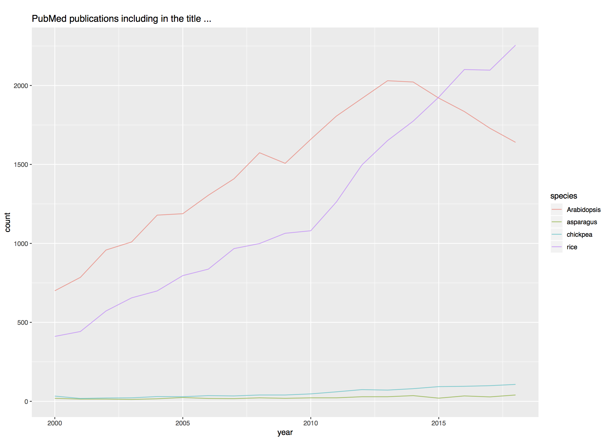

[Home](../index.html)

### 2020
* <a href="#global-yields-">Oct</a>    
* <a href="#weve-got-a-cover-">Sep</a>    
* <a href="#lockdown">Aug</a>   
* <a href="#citations">Jul</a>   
* <a href="#outbreak">May</a>   
* <a href="#chickpea-genes">Mar</a>   

### 2019
 * <a href="#from-uniprot-id-to-retrieving-the-gene-name">Dec</a>   
 * <a href="#genehummus--automated-pipeline-for-gene-annotation">Jul</a>    
 * <a href="#pubmed-titles">Apr</a>    
 * <a href="#taxonomy-identifiers-and-scientific-names-ncbi">Feb</a>    
 * <a href="#data-analytics-case-study-a-ciencia-cierta">Jan</a>    
  
### 2018   
* <a href="#recent-nbs-lrr-gene-expansion-in-the-asparagus-genome">Nov</a>    
* <a href="#our-small-blow-against-the-system">July</a>    
* <a href="#pycon-charlas">May</a>   
  
 

## Global yields
Córdoba, Oct 10, 2020.    
Original data comes from [Our World in Data](https://ourworldindata.org/crop-yields). There is a lot of data on that site. I focused on legumes because my research concerns these species. 
          
    # Dependencies
    library(tidyverse)
    
    # Load data
    crops <- read_csv("files/FAOSTAT_data_9-26-2020.csv")
    
    # Make tidy 
    crops <- crops %>% 
             select(Area,Item,Year, Unit, Value)
    
    # Check yield units
    crops %>% 
          count(Unit)
          
    crops <- crops %>% 
            mutate(Value = Value / 10, Unit = "kg/ha")
            
              
    # Make a plot
    crops %>% 
          group_by(Year) %>% 
          summarize(yield = sum(Value)) %>%
          ggplot(aes(Year, yield)) + 
          geom_line(alpha = 0.8, size = 1.3, col = "steelblue") +
          labs(x = "", y = "kg/ha", caption = "Data source: FAO (Sep 26, 2020)") + 
          ggtitle("Legumes Global Yield") +
          scale_y_continuous(labels = scales::comma_format())

 

## We've got a Cover !
Córdoba, Sep 21, 2020.  
In our latest paper we found several mutations in highly conserved features of a blueberry *MYB* transcription factor that affect the regulation of the anthocyanin biosynthesis. You can read about it [here](https://www.mdpi.com/2073-4395/10/9/1296). We just knew that the paper was selected as the journal issue cover.  It's pretty exciting!  

 

 
 

## Understanding Molecular Mechanisms Regulating Anthocyanin Biosynthesis in Blueberry
Córdoba, Sep 1, 2020.
  
Blueberries are one of the richest sources of antioxidants, such as anthocyanins, among fruits and vegetables. The characteristic dark blue colored fruit results from the accumulation of anthocyanins in the skin of the berry. 
   
In this study, we used the pink-fruited ‘Pink Lemonade’ to further our understanding of anthocyanin biosynthesis in blueberry and attempt to identify the affected gene in this mutant. Expression analysis of the metabolic structural genes combined with bioinformatic analyses led to the isolation and sequencing of a regulatory gene: the transcription factor *MYB1*. The presence of sequence variants in the *MYB1* gene, along with changes in highly conserved features of the sequence, provide a mechanistic explanation for the mutant phenotype. 
   
Collectively, these results provide valuable information on the regulation of flavonoid biosynthesis in blueberry.     
  
    
Read the paper in [Agronomy](https://www.mdpi.com/2073-4395/10/9/1296)  
 
 

    
    
## Lockdown
Valencia, Aug 2020.  
  
Air pollution levels in Valencia. Comparative Jan-Jul 2019 vs 2020. Covid-19 pandemic lockdown was implemented from March 15 to Jun 20, 2020.   

 
Available [code](https://bookdown.org/josev_die/rpubs/rpubs.html). 

 
 

## Citations
Córdoba, Jul 28, 2020.

Using my package [h Index](https://github.com/jdieramon/hIndex) I have just estimated the citations that I will get by the end of this year : 25 more citations.   
You can also estimate how long it takes on average to get 1 citation for your most highly accessed papers. You can download and install it from my github repo in 3 very simple steps!
        
    # Point to the file downloaded from SCOPUS
    file <- "Downloads/CTOExport.csv"

    # Load library
    library(hIndexOverYears)

    # Tidy data   
    dat <- clean(file)
  
    # Make a plot with hindex over years 
    h.plot(dat, 2007, 2020, 0)

    # Get how long it takes 1 citation per paper
    dat <- get1cite(dat)

    # Expected citation for the next 5 months 
    dat %>% 
      filter(avgMonth < 6) %>% 
      mutate(predicted = ceiling(5 / avgMonth))
 
 

  
  
## FORCE
Córdoba, Jul 2020.   
Let me introduce to you FORCE : understanding the molecular basis of flowering time in chickpea.   
  
[video](https://twitter.com/jdieramon/status/1279787521954795525)
  
 
 

  
## Outbreak
Córdoba, May 2020.   

As part of the activities held in celebration of European Researchers’ Night at the University of Córdoba in Spain last September, MCAA fellows had the opportunity to brief Frank Marx about their projects. Meeting in the Mudéjar Hall, with its delicate ornamental plasterwork (one of the most beautiful rooms at the University Rectorate building), they informed him about nearly finished and ongoing projects. Marx heard about FORCE, a new project aimed to decipher the molecular basis of flowering time in chickpeas. As the enthusiastic new Principal Investigator, I briefed Marx about how the domestication trait defined the adaptation of the species to climatic conditions. I explained how flowering time is a major determinant of chickpea productivity. Adopting an integrative approach by combining computational plant biology and genetic resources exhibiting phenotypic diversity would allow us to understand how genetic variants combine to provide adaptation to specific environments. In the long run, we could use that knowledge for introgression of new traits into adapted genetic backgrounds. I tried but could not contain my excitement. Fast forward four months. On 13 March, we were sent home from our lab (as was the case with many other research institutions around the world). That morning, I picked some notebooks, papers, and notes from my desk. On this day, with the official numbers of COVID-19 cases reaching 4 000 and 120 confirmed deaths in Spain, all lab work and teaching activities were put on hold. I left the University without knowing I would not be able to return to my office in the following two months, maybe even more ... [read more >>](https://www.mariecuriealumni.eu/newsletter/special-coverage-covid-19-newsletter-july-2020) .  
 
 

## chickpea genes
Córdoba, Mar 30, 2020.  
As of end March 2020, the NCBI nucleotide database contains ~ 170,000 chickpea [records](https://www.ncbi.nlm.nih.gov/nuccore/?term=chickpea%5BOrganism%5D). Over 41,200 entries have a link to PubMed. 99.9% of the entries show a link to 1 paper. Only 53 genes have links to 2 or more papers. 

    # Dependencies
    library(ggplot2)

    # Load data
    load("files/pubs4chick_genes.rda")
    
    # Plot a subset of the sample 
    p <- pubs4chick_genes %>% 
    arrange(desc(npubs)) %>% 
    slice(1:325)
    
    p %>% 
    ggplot(aes(x = reorder(geneid, npubs), y = npubs)) + 
    geom_jitter(width = 0.2, col = 2) + 
    theme(axis.text.x = element_blank(), 
        axis.ticks.x = element_blank()) +
    labs(x = "", y = "N. publications") + 
    ggtitle("Chickpea genes", subtitle = "Pubmed database")
    

    
    
 
 

## airqualityES
Córdoba, Mar 3, 2020.  
We are now on [CRAN](https://cran.r-project.org/web/packages/airqualityES/index.html)! The Government of Spain keeps records of air quality measurements. The raw data were originally scattered over a number of files and formats. We have built a simple dataframe for convenience of researches, journalists or general public : https://github.com/jdieramon/airqualityES. 

 
  
  
## From UniProt ID to retrieving the gene name  
Valencia, Dec 27, 2019

    uniprot_mapping <- function(ids) {
        uri <- 'http://www.uniprot.org/uniprot/?query='
        idStr <- paste(ids, collapse="+or+")
        format <- '&format=tab'
        fullUri <- paste0(uri,idStr,format)
        dat <- read.delim(fullUri)
        dat

      }
    
    # Usage
    ids = c("A0A2T3D680", "A0A0F0E143", "A0A0F0E266")
    uniprot_mapping(ids)
    

    
  
 

   

## Getting taxonomy description   
Córdoba, Dec 12, 2019.    

    # Dependencies
    library(dplyr)
    library(rentrez)
    library(XML)
    library(tidyr)
    library(tibble)
    
    # Define a vector with species name 
    orgs = c("Bradyrhizobium liaoningense", "Burkholderiaceae bacterium 26", 
         "Ensifer sp. NM-2" , "Microvirga sp. BSC39", 
         "Rhizobium laguerreae", "Variibacter gotjawalensis")

    # Get taxonomy ids for each species
    taxids <- c()
    for(org in orgs) {
      foo = entrez_search(db = "taxonomy", term = paste0(org,"[SCIN]"))
      taxids <- c(taxids, foo$ids)
    }

    # Programatic access to ENTREZ : xml file
    source("https://raw.githubusercontent.com/jdieramon/my_scripts/master/byRequest/functions.R")

    vals <- get_taxonomy(taxids)

 
 

  
## geneHummus : automated pipeline for gene annotation  
Córdoba, Jul 20, 2019.    

We designed *geneHummus*, a novel R package to identify and characterize members of a plant gene family. Our pipeline is suitable for any taxonomic plant, vastly improving the speed and ease of genomic data processing. The pipeline was mostly designed at the National Center for Biotechnology Information in Bethesda (MD) during May 2018 and we have been working ever since. Documentation is available on [Github](https://github.com/NCBI-Hackathons/GeneHummus/blob/master/vignettes/genHummus.md) and the package is available on [CRAN](https://cran.r-project.org/web/packages/geneHummus/index.html).  
  
Read the paper on [BMC Genomics](https://bmcgenomics.biomedcentral.com/articles/10.1186/s12864-019-5952-2).  
 
 

## PubMed titles
Córdoba, Apr 25, 2019.   

I just saw [@GARNetweets](https://twitter.com/GARNetweets/status/1121424430775848962) tweet on increased number of rice publications in [PubMed](https://www.ncbi.nlm.nih.gov/pubmed/) journals and wanted to figure out my research interests compared to the world. I see great potential for growth!

Here is the code : 
    
    # Dependencies
    library(ggplot2)
    library(dplyr)
    
    # Read the timeline csv file 
    pubmed <- read.csv("files/pubmed.csv")
    
    # Tidy data
    names(pubmed) <- c('year', 'chickpea', 'asparagus', 'Arabidopsis', 'rice')
    pubmed = pubmed[-c(1:2),]
    pubmed_by_year <- gather(pubmed, species, count, -year)
    
    
    # Plot data
    pubmed_by_year %>% mutate(year = as.double(as.character(pubmed_by_year$year)), 
                          count = as.double(pubmed_by_year$count)) %>% 
                          ggplot(aes(x = year, y = count, col = species)) + 
                          geom_line(alpha = 0.7) + 
                          ggtitle("PubMed publications including in the title ...", )
                          
                      

 
 

## Getting descendent taxa 
Córdoba, Apr 13, 2019.  
  
I want to pull all taxIDs or accessions in a taxonomic family.

    # Dependencies
    library(rentrez)
    
    # Define a function : 
    extract_ids <- function(family) {
      myterm = paste0(family, "[SBTR]")
      myfamily = entrez_search(db = "taxonomy", term = myterm)
      myfamily = entrez_search(db = "taxonomy", term = myterm, 
                               retmax = myfamily$count)
      
      myfamily$ids
      
      }

Now, I call the function for the *Cucurbitaceae* family.  
  
    cucurbis <- extract_ids("Cucurbitaceae")
        
    cucurbis[1:10]
     [1] "2528464" "2507986" "2507985" "2507984" "2507586"
     [6] "2501430" "2497034" "2490558" "2478897" "2421479"

    
  

## Taxonomy identifiers and scientific names (NCBI) 
Córdoba, Feb 25, 2019.  

I have a long list of species names and my goal is to get the taxonomy identifiers from GenBank. 
I wrote some functions to fetch the NCBI ids. 

    # Dependencies
    library(rentrez)
    
    # Define some functions : 
    get_tax_id <- function(scientific_name) {
      myterm = paste0(scientific_name,"[SCIN]")
      esearch = entrez_search(db = "taxonomy", term = myterm)
      esearch$ids
      }
      
    get_scientific_name <- function(taxid) {
      esumm <- entrez_summary(db="taxonomy", id=taxid)
      esumm$scientificname
      }
      
From species name to taxonomy id :

    mycicer <- c("Cicer macracanthum", "Cicer canariense", "Cicer chorassanicum", "Cicer cuneatum", "Cicer judaicum", 
            "Cicer yamashitae", "Cicer bijugum", "Cicer reticulatum", "Cicer echinospermum", "Cicer pinnatifidum", 
            "Cicer arietinum")
    
    mytaxids = sapply(mycicer, function(x) get_tax_id(x), USE.NAMES = FALSE)
    
    mytaxids
      [1] "200949" "200948" "107682" "92720"  "92719"  "92718" 
      [7] "90899"  "90898"  "90897"  "47088"  "3827" 

From taxonomy id to scientific name : 
       
    mynames = sapply(mytaxids, function(x) get_scientific_name(x), USE.NAMES = FALSE)
    
    mynames
     [1] "Cicer macracanthum"  "Cicer canariense"  
     [3] "Cicer chorassanicum" "Cicer cuneatum"     
     [5] "Cicer judaicum"      "Cicer yamashitae"   
     [7] "Cicer bijugum"       "Cicer reticulatum"  
     [9] "Cicer echinospermum" "Cicer pinnatifidum" 
     [11] "Cicer arietinum" 

 

## h Index
Córdoba, Feb 2, 2019.  
  
I just updated my old pkg. `h Index Over Years`. The R pkg. is based on the Citation record from SCOPUS and plots the h Index over the years for a given author. You can also estimate how long it takes on average to get 1 citation for your most highly accessed papers. You can download and install it from my [github](https://github.com/jdieramon/hIndex) repo in 3 very simple steps. 
  
   
 

 
    
## Data Analytics. Case study: A Ciencia Cierta
Córdoba, Jan 22, 2019.     
      
**A Ciencia Cierta** is a scientific dissemination Spanish radio show on 'CV radio'. You can find the podcasts on [IVOOX](https://www.ivoox.com/podcast-a-ciencia-cierta_sq_f1350590_1.html). I made a video-tutorial to study how the episodes length changed over time. The video is available on [YouTube](https://www.youtube.com/watch?v=nbSIXl6I8-4) and you can find the code [here](files/2019_21_01.md).   

  
 

## Recent NBS-LRR Gene Expansion in the Asparagus Genome
Córdoba, Nov 25, 2018.    
  
We performed a genome-wide analysis and comprehensive characterization of 49 NBS-LRR loci in the asparagus reference genome.  Take-away message:  
 1. NBS genes are unevenly distributed through the genome and nearly 50% of the genes are present in clusters. Chromosome 6 is significantly NBS-enriched and one single cluster hosts 10% of the genes.
 2. Recent duplications are likely to have dominated the NBS expansion with both tandem genes and duplication events across multiple chromosomes. Almost all the segmental duplications that we can detect have evolved from these recent events.
 3. Expression data revealed that most of the duplicated members within a group exhibited the same expression pattern, suggesting that the functional conservation of the duplicated family members is a major feature of the evolution of these genes.  
    
Read the paper in [Genes](https://www.mdpi.com/2073-4425/9/12/568/htm).      
  
## Reducing complexity
Córdoba, Nov 17, 2018.  
  
Note for others (and my future self) : I am preparing some material for an introductory course for Data Analysis using R. When thinking about reducing complexity, these posts helped me to see the appealing side of the `tidyverse` for beginners :   
  
  * Don't teach students the hard way first (by [David Robinson](http://varianceexplained.org/r/teach-hard-way/))  
  * Teach the tidyverse to beginners (by [David Robinson](http://varianceexplained.org/r/teach-tidyverse/))  
  * Teaching R to New Users - From tapply to the Tidyverse (by [Roger D. Peng](https://simplystatistics.org/2018/07/12/use-r-keynote-2018/))  
  
 

## Our small blow against the system  
Córdoba, July 2, 2018.

Today, I got a manuscript review invitation. The authors studied a metabolic pathway, which I am very interested in. It's fruit quality-related. The methodolical approach was sound to me as well. The journal was open access and I try to support that philosophy by publishing in those journal or accepting their invitations. So, I almost made my decision when I read that they were expecting my comments within a week.   

For the reasons I have just explained I wanted to review the manuscript. The deadline was not acceptable, though. So, for the first time, I used the great 'small blow against the system' by [Stephen Heard](https://scientistseessquirrel.wordpress.com/2018/03/06/i-refuse-all-review-requests-with-deadlines-3-weeks-heres-why-and-how/). Thus, I sent to them the following:

*Dear Editor,*

*I’d be happy to review this manuscript, but not with a 7-day deadline.  For several reasons, I believe such short deadlines are unreasonable and work to the detriment of science. They foster unhealthy attitudes about the low value of peer review.  They encourage scientists to have unrealistic expectations for the speed of review and publication.  They drive journals to lower quality by competing based on speed rather than on the value added through peer review.* 

*So, I’d be happy to review with a 3-week deadline.  Let me know if that suits you.*

*Sincerely,*

*Jose V. Die*

They got back to me in 2 hours and were supportive wiht the idea that I needed more time.

 

## PyCon Charlas
Bethesda (MD), May 17, 2018.  

Recientemente he tenido el honor de participar en la selección de las charlas que han formado parte de las PyCon Charlas en la 
[PyCon](https://us.pycon.org/2018/) que acaba de celebrarse en Cleveland (OH). Es la primera vez que en una conferencia PyCon US, 
las presentaciones se hacen en un idioma distinto del inglés. Se trata de una gran iniciativa coordinada por **Mayela Sánchez**, 
**Mario Corchero** y **Naomi Ceder**, y una oportunidad para toda la comunidad pythonista hispanohablante, 
cada vez más numerosa tanto en América Latina como en Europa, de exponerse ante la conferencia Python más grande del mundo... [read more >>](files/2018_05_17.md) .  

 

## Auxin response factor gene family in chickpea genome 
Bethesda (MD), May 2, 2018.  

We performed a genome-wide analysis and comprehensive characterization of 24 ARF genes in the chickpea reference genome. Take-away message:  
 1. Phylogenetic analysis suggests that recent duplications have played a very limited role in the expansion of the ARF family.
 2. Diversification of the ARF gene family is based on duplications, variations in domain organization and alternative splicing. Concerning duplications, segmental, but not tandem duplications, have contributed to the expansion.
 3. Duplicated pair genes have evolved mainly under the influence of purifying selection pressure with restricted functional divergence.
 4. Promoter sequence analysis reveals an enrichment of several *cis*-regulatory elements related to symbiosis, and modulation of plant gene expression during the interaction with microbes.  
          
          
Read the paper in [BMC Genomics](https://bmcgenomics.biomedcentral.com/articles/10.1186/s12864-018-4695-9).  

